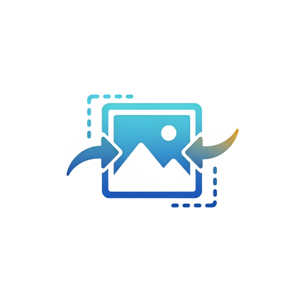
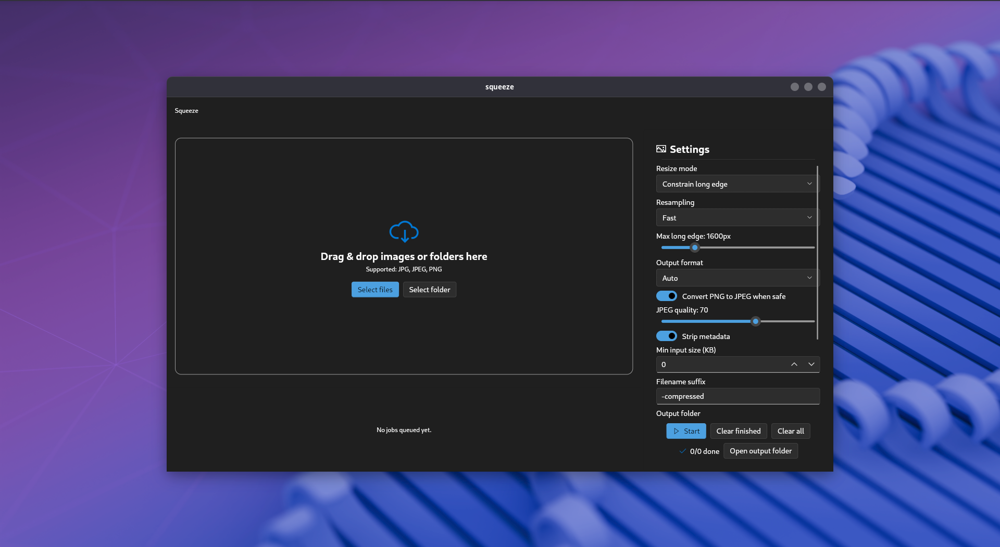
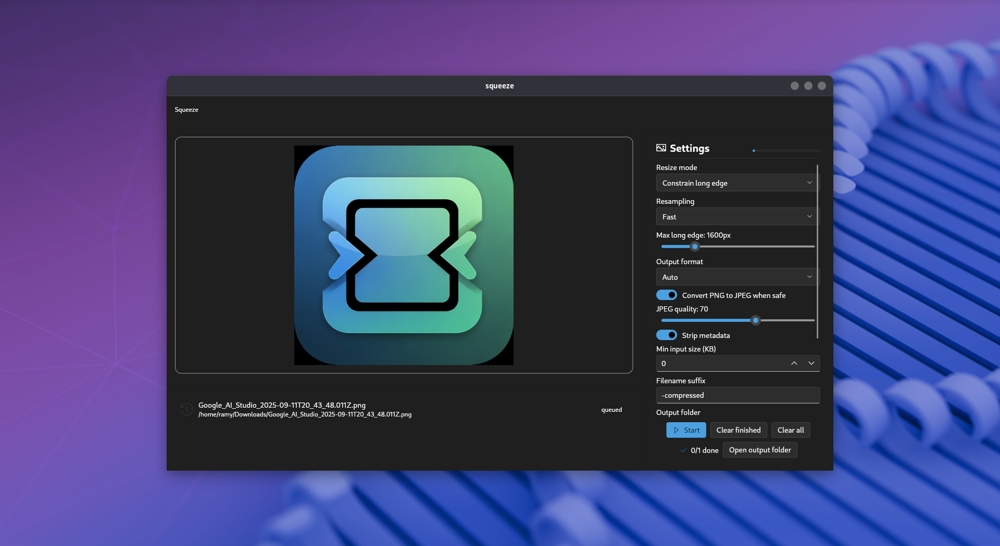
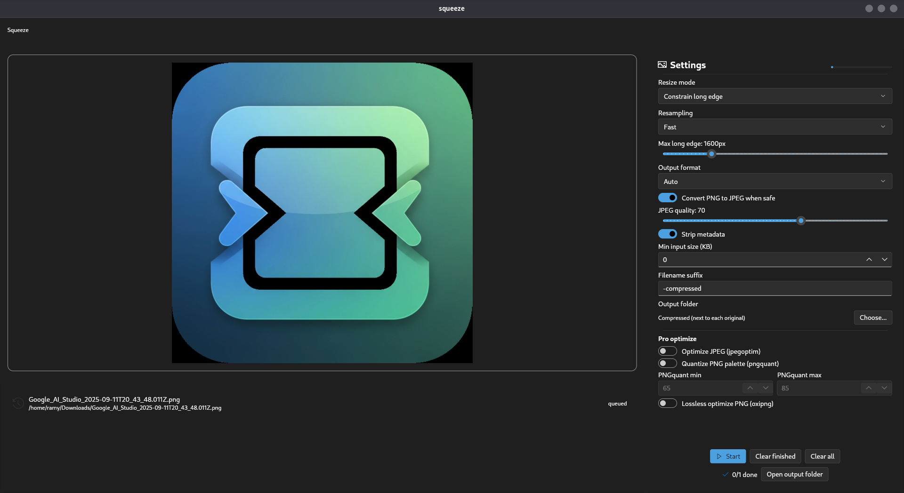
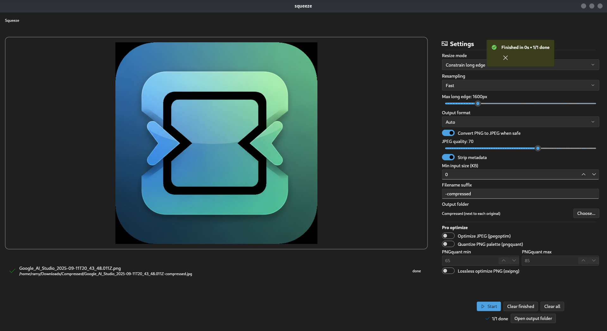

<p align="center">
  
</p>

<h1 align="center">Squeeze</h1>

<p align="center">
  <strong>A simple, elegant, and private desktop app for compressing and resizing your images.</strong>
</p>

<p align="center">
  <a href="https://github.com/RotRot-pi/squeeze/actions/workflows/release.yml">
    
  </a>
  <a href="https://github.com/RotRot-pi/squeeze/releases">
    
  </a>
  <a href="LICENSE">
    
  </a>
</p>

Fast, private, cross-platform image compression. Drag & drop folders or files, tweak a couple of options, and ship smaller images in seconds. Built with Flutter.

---

## ✨ Features

-   **Cross-Platform:** Works on Windows, macOS, and Linux.
-   **Privacy First:** All processing is done locally on your machine. No uploads, no tracking.
-   **Batch Processing:** Drag and drop entire folders; Squeeze will find all the images.
-   **Smart Defaults:** Automatically handles EXIF orientation and protects transparent backgrounds.
-   **Flexible Resizing:** Constrain by edge, fit within a box, fill a specific size, and more.
-   **"Pro" Mode:** Optional, lossless optimization using popular command-line tools (`jpegoptim`, `pngquant`, `oxipng`).

## 📸 Screenshots

<p align="center">
  
  
</p>
<p align="center">
  
  
</p>


## 🚀 Installation

### For Users

The easiest way to get started is to download the latest pre-compiled version for your operating system.

<p align="center">
  <a href="https://github.com/RotRot-pi/squeeze/releases">
    
  </a>
</p>

### For Developers

If you want to build the app from the source, you'll need to have the [Flutter SDK](https://flutter.dev/docs/get-started/install) installed.

```bash
# 1. Clone the repository
git clone https://github.com/RotRot-pi/squeeze.git
cd squeeze

# 2. Install dependencies
flutter pub get

# 3. Run the app
# (Make sure you have enabled desktop support via `flutter config`)
flutter run -d [windows|macos|linux]
```

## 🤝 Contributing

Contributions are welcome! If you have a feature request, bug report, or want to improve the code, please feel free to:

1.  Fork the repository.
2.  Create a new branch (`git checkout -b feature/YourAmazingFeature`).
3.  Commit your changes (`git commit -m 'Add some AmazingFeature'`).
4.  Push to the branch (`git push origin feature/YourAmazingFeature`).
5.  Open a new Pull Request.

## 📄 License

This project is licensed under the MIT License - see the [LICENSE](LICENSE) file for details.